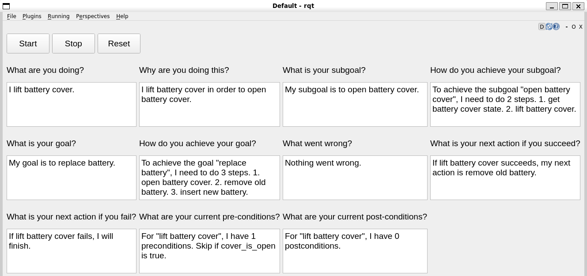

# HOMESTRI-Explanation-BTs

**ROS packages for running explainable behavior trees with Docker setup for HOMESTRI UR5e robot environment.**

This repository contains ROS packages for running explainable behavior trees (BTs) for the HOMESTRI UR5e robot environment. It includes a Docker setup to simplify the environment configuration.



## Prerequisites

Before you get started, ensure that your system meets the following prerequisites:

- **Ubuntu Operating System**: This project has been tested on Ubuntu 22.04.
- **Installed Nvidia Drivers**: Refer to [How to Install Nvidia Drivers on Ubuntu 22.04](https://linuxconfig.org/how-to-install-the-nvidia-drivers-on-ubuntu-22-04) for installation instructions.
- **Docker Engine**: Install Docker Engine by following the guide provided in [Docker Engine Installation](https://docs.docker.com/engine/install/ubuntu/).
- **Nvidia Container Toolkit**: Setup Nvidia Container Toolkit using the instructions in [Nvidia Container Toolkit Installation](https://docs.nvidia.com/datacenter/cloud-native/container-toolkit/latest/install-guide.html#setting-up-nvidia-container-toolkit).
- **(Optional) Nvidia CUDA Toolkit**: If needed, you can install Nvidia CUDA Toolkit on Ubuntu 22.04 by following [Install Nvidia CUDA Toolkit on Ubuntu 22.04](https://installati.one/install-nvidia-cuda-toolkit-ubuntu-22-04/).

## Installation Steps for Development

Follow these steps to set up your environment for UR5e robot development:

1. **Install Prerequisites**: Ensure that your system meets the prerequisites listed above, including Nvidia drivers, Docker Engine, and Nvidia Container Toolkit.

2. **Configure Docker**: To run Docker commands without using `sudo`, perform the following steps:

    ```bash
    sudo groupadd docker
    sudo usermod -aG docker ${USER}
    reboot
    ```

3. **Clone the Repository**: Clone this repository to your local machine using the following command:

    ```bash
    git clone https://github.com/ian-chuang/HOMESTRI-Explanation-BTs.git homestri_explanation_bts
    cd homestri_explanation_bts
    git submodule init
    git submodule update
    ```

4. **Install Visual Studio Code Extensions**: Install the Docker extension and Remote Development extension for Visual Studio Code.

5. **Run the Docker Container**: Navigate to the root folder of the cloned repository and run the following command to start the Docker container:

    ```bash
    docker compose up
    ```

6. **Attach Visual Studio Code**: Open Visual Studio Code, go to the Docker tab, right-click on the container, and select "Attach VSCode." This action will provide you with a Visual Studio Code environment within the container, preconfigured with ROS settings.

## How to Run

To run the system, follow these steps:

- **Bringing up the Fake Robot**: Run the following command to bring up the fake robot:

    ```bash
    roslaunch xbt_bringup fake_bringup.launch
    ```

- **Bringing up the Real Robot**: Alternatively, if you have a real robot, use this command to bring it up:

    ```bash
    roslaunch xbt_bringup real_bringup.launch
    ```

- **Creating and Running Behavior Trees**: To create and run behavior trees, refer to the `xbt_bringup/bt_xml` directory for organization. Each behavior tree is enclosed in its directory within `xbt_bringup/bt_xml`. This directory contains multiple XML files for different subtrees of the behavior tree and a main XML file that contains the starting tree.

    Additionally, there must be a 'config' folder that contains:
    - `settings.yaml` and `tags.yaml` for configuring the apriltag_ros package.
    - `transforms.yaml` for configuring and publishing static transforms in tf2_ros.

    To run, use the following command, replacing `{bt directory name in bt_xml}` with the name of the behavior tree directory you want to use in `xbt_bringup/bt_xml`. For example, if you have a directory `xbt_bringup/bt_xml/collect_zeolite`, then you would put `bt:=collect_zeolite` as follows:

    ```bash
    roslaunch xbt_bringup run_xbt.launch bt:=collect_zeolite
    ```

    Once you launch, the explainable behavior tree GUI will open. To run the behavior tree, click the 'Run' button.
